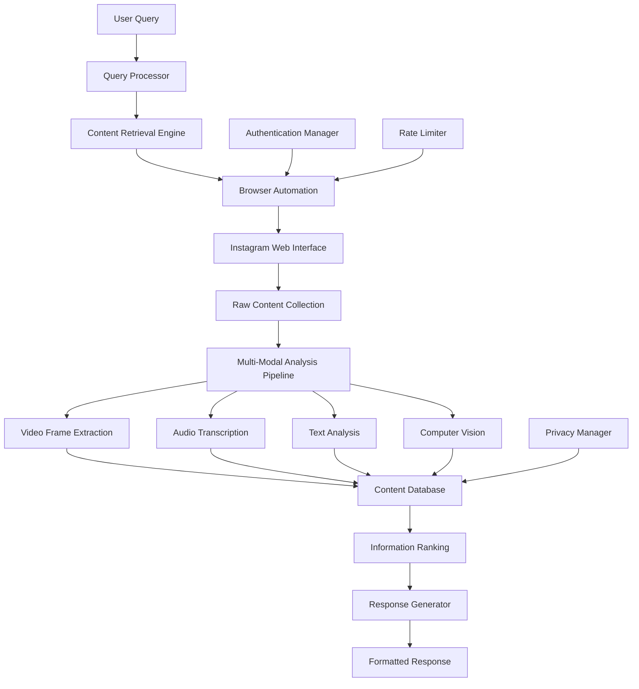

# Design Document: Instagram Content Analyzer

## Overview

The Instagram Content Analyzer is a multi-modal AI system that extracts and analyzes information from a user's saved Instagram collection to answer natural language queries. Since Instagram's official APIs don't provide access to saved posts, the system uses browser automation to collect content, then applies computer vision, audio transcription, and natural language processing to extract structured information.

The system architecture follows a pipeline approach: data collection → multi-modal analysis → information extraction → query processing → response generation. Each component is designed to handle the unique challenges of processing diverse Instagram content types while maintaining user privacy and system reliability.

## Architecture



The system uses a microservices architecture with the following key components:

- **Authentication Manager**: Handles Instagram login and session management
- **Content Retrieval Engine**: Orchestrates browser automation for data collection
- **Multi-Modal Analysis Pipeline**: Processes different content types in parallel
- **Content Database**: Stores extracted information with privacy controls
- **Query Processor**: Interprets natural language queries and routes to appropriate handlers
- **Response Generator**: Formats and presents results to users

## Components and Interfaces

### Authentication Manager

**Purpose**: Manages Instagram authentication and session persistence
**Key Methods**:
- `authenticate_user()`: Initiates Instagram login flow
- `refresh_session()`: Maintains active session
- `validate_credentials()`: Checks authentication status

**Interface**:
```python
class AuthenticationManager:
    def authenticate_user(self, credentials: UserCredentials) -> AuthResult
    def refresh_session(self, session_id: str) -> SessionStatus
    def validate_credentials(self, session_id: str) -> bool
    def logout_user(self, session_id: str) -> None
```

### Content Retrieval Engine

**Purpose**: Orchestrates browser automation to collect saved Instagram content
**Key Methods**:
- `collect_saved_content()`: Retrieves all saved posts and reels
- `download_media()`: Downloads video/audio files for processing
- `extract_metadata()`: Collects captions, hashtags, and engagement data

**Interface**:
```python
class ContentRetrievalEngine:
    def collect_saved_content(self, session_id: str) -> List[ContentItem]
    def download_media(self, content_url: str) -> MediaFile
    def extract_metadata(self, content_item: ContentItem) -> ContentMetadata
    def handle_rate_limits(self) -> None
```

### Multi-Modal Analysis Pipeline

**Purpose**: Processes different content types to extract structured information
**Components**:
- **Video Processor**: Extracts frames and analyzes visual content
- **Audio Processor**: Transcribes speech and identifies audio elements
- **Text Processor**: Analyzes captions, hashtags, and comments
- **Vision Processor**: Identifies objects, text overlays, and visual elements

**Interface**:
```python
class MultiModalAnalyzer:
    def process_video(self, video_file: VideoFile) -> VideoAnalysis
    def process_audio(self, audio_file: AudioFile) -> AudioTranscription
    def process_text(self, text_content: str) -> TextAnalysis
    def process_images(self, image_frames: List[ImageFrame]) -> VisionAnalysis
```

### Content Database

**Purpose**: Stores extracted information with efficient querying capabilities
**Key Features**:
- Encrypted storage for user privacy
- Semantic search capabilities
- Temporal indexing for recency weighting
- Category-based organization

**Interface**:
```python
class ContentDatabase:
    def store_analysis(self, content_id: str, analysis: ContentAnalysis) -> None
    def search_by_category(self, category: str, limit: int) -> List[ContentItem]
    def search_by_keywords(self, keywords: List[str]) -> List[ContentItem]
    def get_recent_content(self, days: int) -> List[ContentItem]
    def delete_user_data(self, user_id: str) -> None
```

### Query Processor

**Purpose**: Interprets natural language queries and extracts search intent
**Key Methods**:
- `parse_query()`: Extracts intent, entities, and parameters
- `identify_category()`: Determines content category (places, products, advice, etc.)
- `extract_constraints()`: Identifies numerical limits, geographic constraints

**Interface**:
```python
class QueryProcessor:
    def parse_query(self, query: str) -> QueryIntent
    def identify_category(self, query: str) -> ContentCategory
    def extract_constraints(self, query: str) -> QueryConstraints
    def suggest_alternatives(self, query: str) -> List[str]
```

### Response Generator

**Purpose**: Formats search results into natural language responses
**Key Methods**:
- `generate_response()`: Creates conversational responses
- `rank_results()`: Orders results by relevance and confidence
- `format_evidence()`: Includes source references and confidence scores

**Interface**:
```python
class ResponseGenerator:
    def generate_response(self, results: List[SearchResult], query: QueryIntent) -> Response
    def rank_results(self, results: List[SearchResult]) -> List[RankedResult]
    def format_evidence(self, result: SearchResult) -> EvidenceBlock
    def handle_no_results(self, query: QueryIntent) -> Response
```

## Data Models

### Core Data Structures

```python
@dataclass
class ContentItem:
    id: str
    url: str
    content_type: ContentType  # POST, REEL, CAROUSEL
    timestamp: datetime
    author: str
    caption: str
    hashtags: List[str]
    media_files: List[MediaFile]
    engagement_metrics: EngagementData

@dataclass
class MediaFile:
    file_path: str
    media_type: MediaType  # IMAGE, VIDEO, AUDIO
    duration: Optional[float]
    resolution: Optional[Tuple[int, int]]
    file_size: int

@dataclass
class ContentAnalysis:
    content_id: str
    text_analysis: TextAnalysis
    vision_analysis: Optional[VisionAnalysis]
    audio_analysis: Optional[AudioTranscription]
    extracted_entities: List[Entity]
    confidence_scores: Dict[str, float]
    processing_timestamp: datetime

@dataclass
class Entity:
    name: str
    category: EntityCategory  # PRODUCT, LOCATION, PERSON, CONCEPT
    confidence: float
    source: EntitySource  # CAPTION, HASHTAG, VISION, AUDIO
    context: str

@dataclass
class QueryIntent:
    original_query: str
    intent_type: IntentType  # SEARCH, RANKING, COMPARISON
    target_category: ContentCategory
    constraints: QueryConstraints
    expected_count: Optional[int]

@dataclass
class SearchResult:
    entity: Entity
    supporting_content: List[ContentItem]
    relevance_score: float
    recency_score: float
    confidence_score: float
    evidence_summary: str
```

### Database Schema

The system uses a document-based database (MongoDB) with the following collections:

**users**: User authentication and preferences
**content_items**: Raw Instagram content metadata
**content_analysis**: Processed analysis results
**entities**: Extracted entities with relationships
**query_history**: User query patterns for optimization

Key indexes:
- `entities.category + entities.confidence` (compound)
- `content_items.timestamp` (descending)
- `content_analysis.extracted_entities.name` (text search)

## Error Handling

### Browser Automation Resilience

The system handles Instagram's anti-automation measures through:
- **Randomized delays**: Human-like interaction timing
- **Session rotation**: Multiple browser profiles
- **Captcha detection**: Pause and alert user when captcha appears
- **Rate limit detection**: Exponential backoff when limits hit

### Content Processing Failures

Multi-modal analysis includes fallback strategies:
- **Vision API failures**: Retry with different models (GPT-4V → Claude Vision → local OCR)
- **Audio transcription errors**: Skip audio analysis, continue with visual/text
- **Large file handling**: Automatic compression and chunking for oversized content

### Data Consistency

The system maintains data integrity through:
- **Transactional updates**: Atomic operations for content analysis
- **Validation pipelines**: Schema validation at each processing stage
- **Rollback mechanisms**: Ability to revert failed processing attempts

## Testing Strategy

### Unit Testing Approach

The system requires comprehensive unit testing for each component:

**Authentication Manager Tests**:
- Mock Instagram login flows
- Test session persistence and refresh
- Validate credential security measures

**Content Processing Tests**:
- Test video frame extraction with sample files
- Validate audio transcription accuracy
- Test text analysis with various caption formats

**Query Processing Tests**:
- Test intent recognition across query variations
- Validate entity extraction from natural language
- Test constraint parsing (numbers, locations, categories)

### Property-Based Testing Strategy

The system will use property-based testing to validate correctness across diverse inputs. Property tests will use the Hypothesis library for Python, configured to run minimum 100 iterations per property to ensure comprehensive coverage through randomization.

Each property test will be tagged with: **Feature: instagram-content-analyzer, Property {number}: {property_text}**

## Correctness Properties

*A property is a characteristic or behavior that should hold true across all valid executions of a system—essentially, a formal statement about what the system should do. Properties serve as the bridge between human-readable specifications and machine-verifiable correctness guarantees.*

### Property 1: Authentication Token Security
*For any* successful authentication, the stored access token should be encrypted and retrievable only through secure methods, and expired tokens should trigger re-authentication flows.
**Validates: Requirements 1.2, 1.3**

### Property 2: Content Retrieval Completeness  
*For any* user's saved collection, the system should retrieve and process all available posts, reels, and media items including all carousel content.
**Validates: Requirements 2.1, 2.3, 2.4**

### Property 3: Rate Limiting Resilience
*For any* API rate limit or error condition, the system should implement exponential backoff retry strategies and graceful degradation.
**Validates: Requirements 2.2, 2.5**

### Property 4: Multi-Modal Content Processing
*For any* content item with video, audio, or text components, the system should extract information from all available modalities and assign confidence scores to extracted data.
**Validates: Requirements 3.1, 3.2, 3.3, 3.4, 3.5**

### Property 5: Query Intent Recognition
*For any* natural language query, the system should correctly identify the intent category and extract relevant entities (locations, products, advice topics) regardless of phrasing variations.
**Validates: Requirements 4.1, 4.2, 4.3, 4.4, 4.5**

### Property 6: Relevance Ranking Consistency
*For any* set of search results, items with higher frequency, recency, and engagement should receive higher relevance scores, and duplicate entities should be properly aggregated.
**Validates: Requirements 5.1, 5.2, 5.3, 5.4**

### Property 7: Result Count Constraints
*For any* query specifying a numerical limit (e.g., "top 3"), the system should return exactly that number of results when sufficient content exists.
**Validates: Requirements 5.5**

### Property 8: Response Formatting Completeness
*For any* search result, the response should include source references, confidence scores, and appropriate geographic context for location-based results.
**Validates: Requirements 6.1, 6.2, 6.3**

### Property 9: Empty Result Handling
*For any* query that matches no content, the system should provide alternative query suggestions or clear explanations of the limitation.
**Validates: Requirements 6.5**

### Property 10: Data Privacy and Cleanup
*For any* user data, it should be encrypted at rest, temporary media files should be deleted after processing, and data deletion requests should remove all associated information.
**Validates: Requirements 7.1, 7.2, 7.3**

### Property 11: Security Audit Logging
*For any* system access attempt, appropriate log entries should be created for security monitoring purposes.
**Validates: Requirements 7.5**

### Property 12: Comprehensive Error Handling
*For any* system error (API unavailability, no matches, rate limits), the system should provide user-friendly messages with actionable guidance while protecting technical implementation details.
**Validates: Requirements 8.1, 8.2, 8.4, 8.5**

### Property 13: Progress Reporting
*For any* long-running analysis operation, the system should provide progress indicators with estimated completion times.
**Validates: Requirements 8.3**

## Testing Strategy

### Dual Testing Approach

The system requires both unit testing and property-based testing for comprehensive coverage:

**Unit Tests**: Focus on specific examples, edge cases, and integration points
- Authentication flow with valid/invalid credentials
- Content processing with sample Instagram posts
- Query parsing with known input/output pairs
- Error handling with specific failure scenarios

**Property Tests**: Verify universal properties across all inputs using Hypothesis library
- Minimum 100 iterations per property test for comprehensive randomization
- Each test tagged with: **Feature: instagram-content-analyzer, Property {number}: {property_text}**
- Generate diverse inputs to validate system behavior across the full input space

### Testing Configuration

**Property-Based Testing Setup**:
- Library: Hypothesis for Python
- Minimum iterations: 100 per property test
- Timeout: 60 seconds per property test
- Shrinking: Enabled for minimal counterexamples

**Unit Testing Balance**:
- Focus on concrete examples that demonstrate correct behavior
- Test integration between components (authentication → content retrieval → analysis)
- Validate edge cases like empty collections, malformed content, network failures
- Property tests handle comprehensive input coverage, unit tests focus on specific scenarios

**Test Data Management**:
- Mock Instagram responses for consistent testing
- Sample media files for multi-modal analysis testing
- Synthetic user queries covering all intent categories
- Test database with known content for query validation

### Integration Testing

**End-to-End Scenarios**:
- Complete user journey from authentication to query response
- Multi-modal content processing pipeline validation
- Error recovery and retry mechanism testing
- Performance testing with large saved collections

**Browser Automation Testing**:
- Mock Instagram web interface for consistent automation testing
- Rate limiting simulation and recovery validation
- Session management and persistence testing
- Captcha detection and user notification testing